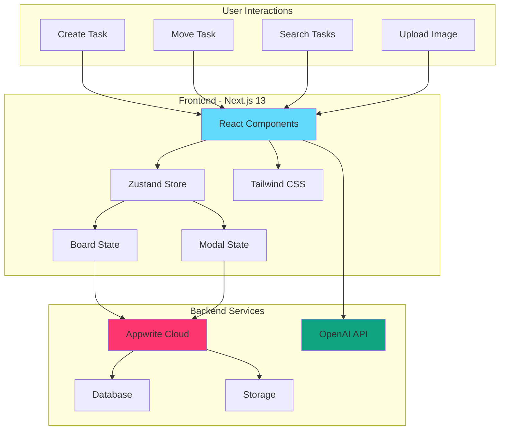
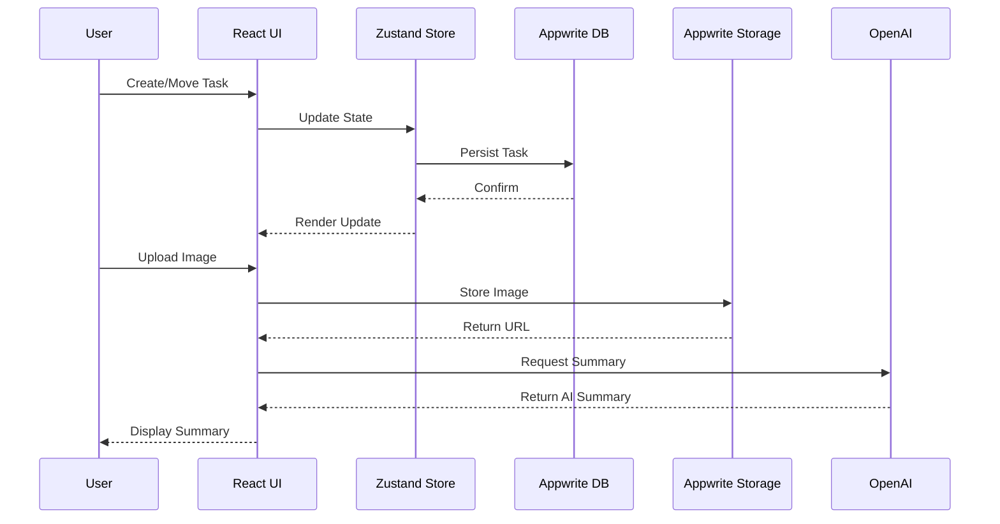

# Trello 2.0

A modern, AI-powered task management application that brings Trello's Kanban workflow to life with intelligent task summaries and seamless drag-and-drop interactions.

Built in 2023-2024. This Next.js application combines the simplicity of Kanban boards with the power of AI to help you stay organized and productive.

## Features

- 📋 **Kanban Board**: Visual task management with Todo, In Progress, and Done columns
- 🎯 **Drag & Drop**: Intuitive task movement between columns with real-time persistence
- 🖼️ **Image Attachments**: Add visual context to tasks with image uploads
- 🔍 **Real-time Search**: Instantly filter tasks across all columns
- 🤖 **AI-Powered Summaries**: Get daily productivity insights powered by OpenAI GPT-3.5
- ☁️ **Cloud Storage**: Secure backend with Appwrite database and storage
- 📱 **Responsive Design**: Works seamlessly on desktop, tablet, and mobile
- ⚡ **Real-time Updates**: Changes sync instantly across the application

## Architecture Overview



## Data Flow



## Getting Started

### Prerequisites

- Node.js (v18 or higher)
- npm, yarn, or pnpm
- Appwrite account (free tier available)
- OpenAI API key

### Installation

1. Clone the repository:
```bash
git clone https://github.com/orassayag/trello2.0.git
cd trello2.0
```

2. Install dependencies:
```bash
npm install
# or
pnpm install
# or
yarn install
```

3. Set up environment variables:
```bash
cp .env.example .env.local
```

Edit `.env.local` with your credentials:
```env
NEXT_PUBLIC_APPWRITE_PROJECT_ID=your_project_id
NEXT_PUBLIC_DATABASE_ID=your_database_id
NEXT_PUBLIC_TODOS_COLLECTION_ID=your_collection_id
NEXT_PUBLIC_IMAGE_BUCKET_ID=your_bucket_id
OPENAI_API_KEY=your_openai_api_key
```

4. Set up Appwrite:
   - Create a project at [Appwrite Cloud](https://cloud.appwrite.io/)
   - Create a database and collection with these attributes:
     - `title` (String, required)
     - `status` (String, required, enum: "todo", "inprogress", "done")
     - `image` (String, optional)
   - Create a storage bucket for images

5. Build and run:
```bash
npm run build
npm run dev
```

6. Open [http://localhost:3000](http://localhost:3000) in your browser

## Available Scripts

### Development
Start the development server with hot reload:
```bash
npm run dev
```

### Build
Compile the application for production:
```bash
npm run build
```

### Start
Run the production build:
```bash
npm run start
```

### Lint
Check code for linting errors:
```bash
npm run lint
```

## Project Structure

```
trello2.0/
├── src/
│   ├── app/
│   │   ├── api/
│   │   │   └── generateSummary/     # OpenAI integration
│   │   ├── layout.tsx               # Root layout
│   │   └── page.tsx                 # Main page
│   ├── components/
│   │   ├── Board/                   # Kanban board component
│   │   ├── Column/                  # Column component
│   │   ├── Header/                  # App header with search
│   │   ├── Modal/                   # Task creation modal
│   │   ├── TaskTypeRadioGroup/      # Task type selector
│   │   └── TodoCard/                # Individual task card
│   ├── lib/
│   │   ├── fetchSuggestion.ts       # AI summary fetcher
│   │   ├── formatTodosForAI.ts      # Format tasks for AI
│   │   ├── getTodosGroupedByColumn.ts  # Data aggregation
│   │   ├── getUrl.ts                # Image URL helper
│   │   └── uploadImage.ts           # Image upload handler
│   └── store/
│       ├── BoardStore.ts            # Main state management
│       └── ModalStore.ts            # Modal state
├── appwrite.ts                      # Appwrite client config
├── openai.ts                        # OpenAI client config
├── typings.d.ts                     # TypeScript definitions
└── package.json
```

## Technology Stack

### Frontend
- **[Next.js 13](https://nextjs.org/)** - React framework with App Router
- **[React 18](https://react.dev/)** - UI library
- **[TypeScript](https://www.typescriptlang.org/)** - Type safety
- **[Tailwind CSS](https://tailwindcss.com/)** - Utility-first CSS
- **[Zustand](https://github.com/pmndrs/zustand)** - State management
- **[react-beautiful-dnd](https://github.com/atlassian/react-beautiful-dnd)** - Drag and drop
- **[Heroicons](https://heroicons.com/)** - Icon library
- **[react-avatar](https://www.npmjs.com/package/react-avatar)** - Avatar component

### Backend
- **[Appwrite](https://appwrite.io/)** - Backend as a Service
  - Database for task storage
  - Storage for image uploads
  - Real-time updates

### AI
- **[OpenAI GPT-3.5](https://openai.com/)** - AI-powered task summaries

## Key Features Explained

### Drag & Drop Functionality
Tasks can be dragged within columns or between columns. The application handles:
- Same-column reordering
- Cross-column movement with status updates
- Column reordering
- Database persistence for all changes

### AI Task Summary
Every 10 seconds, the application:
1. Collects all tasks from the board
2. Formats them for AI processing
3. Sends them to OpenAI GPT-3.5
4. Displays a personalized productivity summary

### Image Management
- Upload images with tasks via drag-drop or file picker
- Images stored in Appwrite Storage
- Automatic cleanup when tasks are deleted
- Secure URL generation for image display

### Real-time Search
- Client-side filtering for instant results
- Searches across all columns simultaneously
- Highlights matching tasks

## Environment Variables

| Variable | Description | Required |
|----------|-------------|----------|
| `NEXT_PUBLIC_APPWRITE_PROJECT_ID` | Your Appwrite project ID | Yes |
| `NEXT_PUBLIC_DATABASE_ID` | Appwrite database ID | Yes |
| `NEXT_PUBLIC_TODOS_COLLECTION_ID` | Collection ID for tasks | Yes |
| `NEXT_PUBLIC_IMAGE_BUCKET_ID` | Storage bucket ID for images | Yes |
| `OPENAI_API_KEY` | OpenAI API key for summaries | Yes |

## Deployment

### Vercel (Recommended)

1. Push your code to GitHub
2. Import project to [Vercel](https://vercel.com)
3. Add environment variables in project settings
4. Deploy automatically

### Other Platforms

The application can be deployed to any platform supporting Next.js:
- Netlify
- AWS Amplify
- Google Cloud Platform
- Self-hosted with Docker

## Contributing

Contributions to this project are [released](https://help.github.com/articles/github-terms-of-service/#6-contributions-under-repository-license) to the public under the [project's open source license](LICENSE).

Everyone is welcome to contribute. Contributing doesn't just mean submitting pull requests—there are many different ways to get involved, including answering questions and reporting issues.

See [CONTRIBUTING.md](CONTRIBUTING.md) for detailed guidelines.

## Development Guidelines

- Use TypeScript for all new code
- Follow React hooks best practices
- Use Zustand for state management
- Style with Tailwind CSS utility classes
- Test all CRUD operations before committing
- Ensure responsive design works on all devices

## Troubleshooting

### Common Issues

**OpenAI API Rate Limits**
- The app requests summaries every 10 seconds
- Consider increasing the interval in `Header.tsx` line 31
- Check your OpenAI usage dashboard

**Appwrite Connection Errors**
- Verify all environment variables are correct
- Check Appwrite console for API status
- Ensure collection attributes match the schema

**Build Errors**
- Clear `.next` folder and rebuild
- Delete `node_modules` and reinstall
- Check TypeScript errors with `npm run lint`

## Roadmap

- [ ] User authentication
- [ ] Multiple boards support
- [ ] Team collaboration features
- [ ] Task labels and priorities
- [ ] Due dates and reminders
- [ ] Activity history
- [ ] Dark mode
- [ ] Mobile app (React Native)

## Author

* **Or Assayag** - *Initial work* - [orassayag](https://github.com/orassayag)
* Or Assayag <orassayag@gmail.com>
* GitHub: https://github.com/orassayag
* StackOverflow: https://stackoverflow.com/users/4442606/or-assayag?tab=profile
* LinkedIn: https://linkedin.com/in/orassayag

## License

This application has an MIT license - see the [LICENSE](LICENSE) file for details.

## Acknowledgments

- Inspired by [Trello](https://trello.com/)
- Built with [Next.js](https://nextjs.org/)
- Powered by [Appwrite](https://appwrite.io/)
- AI by [OpenAI](https://openai.com/)
