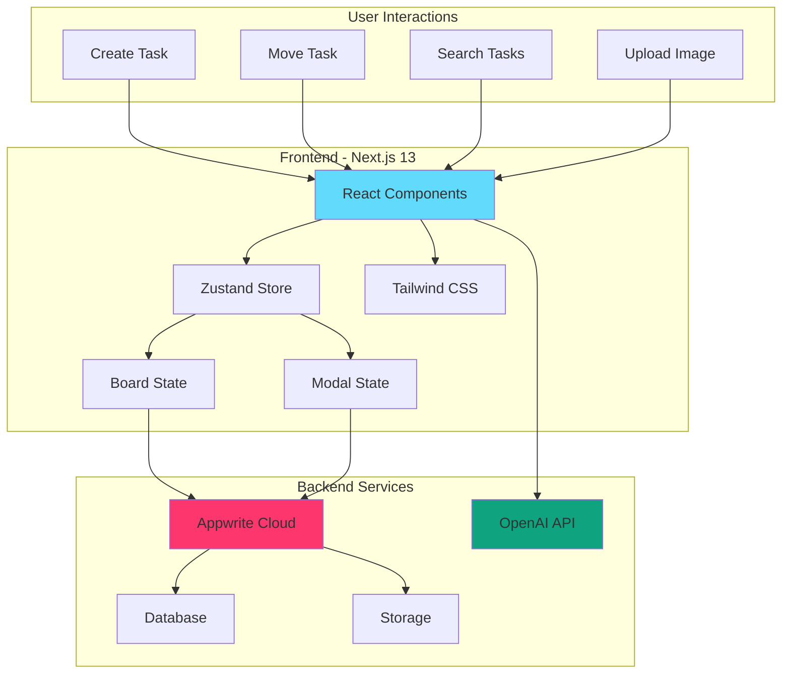
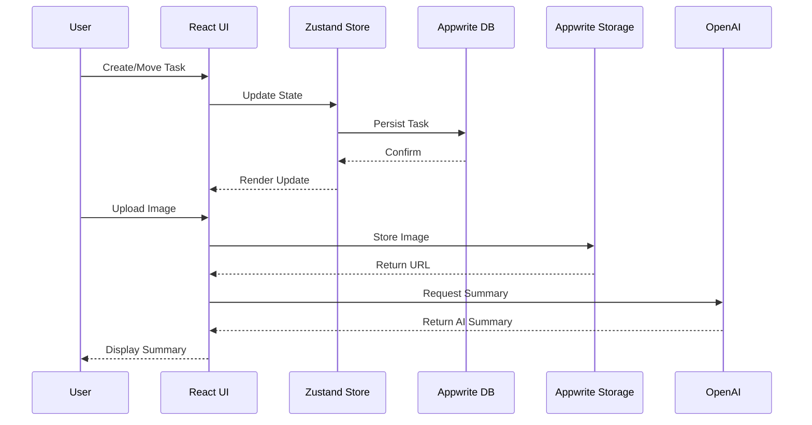

# Trello2.0

A modern, AI-powered task management application that brings Trello's Kanban workflow to life with intelligent task summaries and seamless drag-and-drop interactions.

Built in 2023-2024. This Next.js application combines the simplicity of Kanban boards with the power of AI to help you stay organized and productive.

## Features

### Core Capabilities

- **📋 Kanban Board**: Visual task management with Todo, In Progress, and Done columns
- **🎯 Drag & Drop**: Intuitive task movement between columns with real-time persistence
- **🖼️ Image Attachments**: Add visual context to tasks with image uploads
- **🔍 Real-time Search**: Instantly filter tasks across all columns
- **🤖 AI-Powered Summaries**: Get daily productivity insights powered by OpenAI GPT-3.5
- **☁️ Cloud Storage**: Secure backend with Appwrite database and storage
- **📱 Responsive Design**: Works seamlessly on desktop, tablet, and mobile
- **⚡ Real-time Updates**: Changes sync instantly across the application

### Technical Excellence

- **AI Integration**: Seamless integration with OpenAI for intelligent board summaries
- **Real-time Persistence**: Instant synchronization with Appwrite backend
- **Modern Tech Stack**: Built with Next.js 13, TypeScript, and Tailwind CSS
- **Type Safety**: Full TypeScript implementation for robust and maintainable code
- **State Management**: Lightweight and efficient state handling with Zustand
- **User Experience**: Smooth drag-and-drop interactions using react-beautiful-dnd

### Developer Experience

- **Fast Refresh**: Instant feedback during development with Next.js
- **Component-Driven**: Modular and reusable React components
- **Easy Configuration**: Simple environment-based setup
- **Modern UI**: Clean and intuitive interface built with Tailwind CSS
- **Type Intelligence**: Extensive TypeScript definitions for better IDE support

## Architecture Principles

- **Component-Based Architecture**: Reusable UI components for a consistent design system
- **State-Driven UI**: Reacting to state changes managed by Zustand
- **Separation of Concerns**: Clear distinction between UI components, state logic, and API services
- **Server-Side Rendering**: Utilizing Next.js App Router for optimal performance and SEO
- **Real-time Sync**: Ensuring frontend and backend states are always in harmony

## Design Patterns

- **Store Pattern**: Centralized state management using Zustand stores
- **Provider Pattern**: Leveraging Next.js layouts for global context and styling
- **Repository Pattern**: Abstracting data fetching logic into dedicated library functions
- **Compound Components**: Building complex UI elements like the Kanban Board and Columns
- **API Route Pattern**: Using Next.js API routes for secure backend integrations (e.g., OpenAI)

## Usage

### Managing Tasks

1. **Creating**: Click the "+" button in any column to open the task creation modal.
2. **Moving**: Drag and drop tasks between columns to update their status.
3. **Searching**: Use the search bar in the header to filter tasks in real-time.
4. **AI Summary**: View the AI-generated productivity insights at the top of the board.
5. **Deleting**: Click the trash icon on a task card to remove it permanently.

## Configuration

### Appwrite Setup

1. Create a project at [Appwrite Cloud](https://cloud.appwrite.io/)
2. Create a database and a collection for tasks.
3. Define collection attributes: `title` (String), `status` (String, enum), `image` (String).
4. Create a storage bucket for image attachments.

### OpenAI Setup

1. Obtain an API key from the [OpenAI Platform](https://platform.openai.com/).
2. Ensure you have sufficient credits for GPT-3.5 API calls.

## Directory Structure

```
trello2.0/
├── src/
│   ├── app/                # Next.js App Router routes
│   │   ├── api/            # Backend API endpoints
│   │   └── layout.tsx      # Global layout and providers
│   ├── components/         # Reusable React components
│   │   ├── Board/          # Kanban Board logic
│   │   ├── Column/         # Column rendering
│   │   └── TodoCard/       # Individual task display
│   ├── lib/                # Utility and helper functions
│   │   ├── fetchSuggestion.ts
│   │   └── uploadImage.ts
│   └── store/              # Zustand state stores
│       ├── BoardStore.ts
│       └── ModalStore.ts
├── public/                 # Static assets
├── appwrite.ts             # Appwrite client configuration
├── openai.ts               # OpenAI client configuration
└── package.json            # Project dependencies and scripts
```

## Support

- **Issues**: Report bugs or request features via [GitHub Issues](https://github.com/orassayag/trello2.0/issues)
- **Author**: Or Assayag ([@orassayag](https://github.com/orassayag))
- **Email**: orassayag@gmail.com

## Best Practices

- **Type Safety**: Always define interfaces for data structures in `typings.d.ts`.
- **Performance**: Use efficient state updates to minimize re-renders.
- **Styling**: Stick to Tailwind CSS utility classes for consistent UI.
- **Security**: Never expose API keys on the client side; use environment variables.
- **Clean Code**: Follow Prettier and ESLint configurations for code consistency.

## Architecture Overview


```mermaid
graph TB
    subgraph "Frontend - Next.js 13"
        A[React Components] --> B[Zustand Store]
        B --> C[Board State]
        B --> D[Modal State]
        A --> E[Tailwind CSS]
    end

    subgraph "Backend Services"
        F[Appwrite Cloud]
        G[OpenAI API]
        F --> H[Database]
        F --> I[Storage]
    end

    subgraph "User Interactions"
        J[Create Task] --> A
        K[Move Task] --> A
        L[Search Tasks] --> A
        M[Upload Image] --> A
    end

    C --> F
    D --> F
    A --> G

    style A fill:#61dafb
    style F fill:#fd366e
    style G fill:#10a37f
```

## Data Flow


```mermaid
sequenceDiagram
    participant User
    participant React UI
    participant Zustand Store
    participant Appwrite DB
    participant Appwrite Storage
    participant OpenAI

    User->>React UI: Create/Move Task
    React UI->>Zustand Store: Update State
    Zustand Store->>Appwrite DB: Persist Task
    Appwrite DB-->>Zustand Store: Confirm
    Zustand Store-->>React UI: Render Update

    User->>React UI: Upload Image
    React UI->>Appwrite Storage: Store Image
    Appwrite Storage-->>React UI: Return URL

    React UI->>OpenAI: Request Summary
    OpenAI-->>React UI: Return AI Summary
    React UI-->>User: Display Summary
```

## Getting Started

### Prerequisites

- Node.js (v18 or higher)
- npm, yarn, or pnpm
- Appwrite account (free tier available)
- OpenAI API key

### Installation

1. Clone the repository:

```bash
git clone https://github.com/orassayag/trello2.0.git
cd trello2.0
```

2. Install dependencies:

```bash
npm install
# or
pnpm install
# or
yarn install
```

3. Set up environment variables:

```bash
cp .env.example .env.local
```

Edit `.env.local` with your credentials:

```env
NEXT_PUBLIC_APPWRITE_PROJECT_ID=your_project_id
NEXT_PUBLIC_DATABASE_ID=your_database_id
NEXT_PUBLIC_TODOS_COLLECTION_ID=your_collection_id
NEXT_PUBLIC_IMAGE_BUCKET_ID=your_bucket_id
OPENAI_API_KEY=your_openai_api_key
```

4. Set up Appwrite:
   - Create a project at [Appwrite Cloud](https://cloud.appwrite.io/)
   - Create a database and collection with these attributes:
     - `title` (String, required)
     - `status` (String, required, enum: "todo", "inprogress", "done")
     - `image` (String, optional)
   - Create a storage bucket for images

5. Build and run:

```bash
npm run build
npm run dev
```

6. Open [http://localhost:3000](http://localhost:3000) in your browser

## Available Scripts

### Development

Start the development server with hot reload:

```bash
npm run dev
```

### Build

Compile the application for production:

```bash
npm run build
```

### Start

Run the production build:

```bash
npm run start
```

### Lint

Check code for linting errors:

```bash
npm run lint
```

## Project Structure

```
trello2.0/
├── src/
│   ├── app/
│   │   ├── api/
│   │   │   └── generateSummary/     # OpenAI integration
│   │   ├── layout.tsx               # Root layout
│   │   └── page.tsx                 # Main page
│   ├── components/
│   │   ├── Board/                   # Kanban board component
│   │   ├── Column/                  # Column component
│   │   ├── Header/                  # App header with search
│   │   ├── Modal/                   # Task creation modal
│   │   ├── TaskTypeRadioGroup/      # Task type selector
│   │   └── TodoCard/                # Individual task card
│   ├── lib/
│   │   ├── fetchSuggestion.ts       # AI summary fetcher
│   │   ├── formatTodosForAI.ts      # Format tasks for AI
│   │   ├── getTodosGroupedByColumn.ts  # Data aggregation
│   │   ├── getUrl.ts                # Image URL helper
│   │   └── uploadImage.ts           # Image upload handler
│   └── store/
│       ├── BoardStore.ts            # Main state management
│       └── ModalStore.ts            # Modal state
├── appwrite.ts                      # Appwrite client config
├── openai.ts                        # OpenAI client config
├── typings.d.ts                     # TypeScript definitions
└── package.json
```

## Technology Stack

### Frontend

- **[Next.js 13](https://nextjs.org/)** - React framework with App Router
- **[React 18](https://react.dev/)** - UI library
- **[TypeScript](https://www.typescriptlang.org/)** - Type safety
- **[Tailwind CSS](https://tailwindcss.com/)** - Utility-first CSS
- **[Zustand](https://github.com/pmndrs/zustand)** - State management
- **[react-beautiful-dnd](https://github.com/atlassian/react-beautiful-dnd)** - Drag and drop
- **[Heroicons](https://heroicons.com/)** - Icon library
- **[react-avatar](https://www.npmjs.com/package/react-avatar)** - Avatar component

### Backend

- **[Appwrite](https://appwrite.io/)** - Backend as a Service
  - Database for task storage
  - Storage for image uploads
  - Real-time updates

### AI

- **[OpenAI GPT-3.5](https://openai.com/)** - AI-powered task summaries

## Key Features Explained

### Drag & Drop Functionality

Tasks can be dragged within columns or between columns. The application handles:

- Same-column reordering
- Cross-column movement with status updates
- Column reordering
- Database persistence for all changes

### AI Task Summary

Every 10 seconds, the application:

1. Collects all tasks from the board
2. Formats them for AI processing
3. Sends them to OpenAI GPT-3.5
4. Displays a personalized productivity summary

### Image Management

- Upload images with tasks via drag-drop or file picker
- Images stored in Appwrite Storage
- Automatic cleanup when tasks are deleted
- Secure URL generation for image display

### Real-time Search

- Client-side filtering for instant results
- Searches across all columns simultaneously
- Highlights matching tasks

## Environment Variables

| Variable                          | Description                  | Required |
| --------------------------------- | ---------------------------- | -------- |
| `NEXT_PUBLIC_APPWRITE_PROJECT_ID` | Your Appwrite project ID     | Yes      |
| `NEXT_PUBLIC_DATABASE_ID`         | Appwrite database ID         | Yes      |
| `NEXT_PUBLIC_TODOS_COLLECTION_ID` | Collection ID for tasks      | Yes      |
| `NEXT_PUBLIC_IMAGE_BUCKET_ID`     | Storage bucket ID for images | Yes      |
| `OPENAI_API_KEY`                  | OpenAI API key for summaries | Yes      |

## Deployment

### Vercel (Recommended)

1. Push your code to GitHub
2. Import project to [Vercel](https://vercel.com)
3. Add environment variables in project settings
4. Deploy automatically

### Other Platforms

The application can be deployed to any platform supporting Next.js:

- Netlify
- AWS Amplify
- Google Cloud Platform
- Self-hosted with Docker

## Contributing

Contributions to this project are [released](https://help.github.com/articles/github-terms-of-service/#6-contributions-under-repository-license) to the public under the [project's open source license](LICENSE).

Everyone is welcome to contribute. Contributing doesn't just mean submitting pull requests—there are many different ways to get involved, including answering questions and reporting issues.

See [CONTRIBUTING.md](CONTRIBUTING.md) for detailed guidelines.

## Development Guidelines

- Use TypeScript for all new code
- Follow React hooks best practices
- Use Zustand for state management
- Style with Tailwind CSS utility classes
- Test all CRUD operations before committing
- Ensure responsive design works on all devices

## Troubleshooting

### Common Issues

**OpenAI API Rate Limits**

- The app requests summaries every 10 seconds
- Consider increasing the interval in `Header.tsx` line 31
- Check your OpenAI usage dashboard

**Appwrite Connection Errors**

- Verify all environment variables are correct
- Check Appwrite console for API status
- Ensure collection attributes match the schema

**Build Errors**

- Clear `.next` folder and rebuild
- Delete `node_modules` and reinstall
- Check TypeScript errors with `npm run lint`

## Roadmap

- [ ] User authentication
- [ ] Multiple boards support
- [ ] Team collaboration features
- [ ] Task labels and priorities
- [ ] Due dates and reminders
- [ ] Activity history
- [ ] Dark mode
- [ ] Mobile app (React Native)

## Author

- **Or Assayag** - _Initial work_ - [orassayag](https://github.com/orassayag)
- Or Assayag <orassayag@gmail.com>
- GitHub: https://github.com/orassayag
- StackOverflow: https://stackoverflow.com/users/4442606/or-assayag?tab=profile
- LinkedIn: https://linkedin.com/in/orassayag

## License

This application has an MIT license - see the [LICENSE](LICENSE) file for details.

## Acknowledgments

- Built for educational and research purposes
- Respects robots.txt and implements rate limiting
- Uses user-agent rotation to avoid detection
- Implements polite crawling practices
